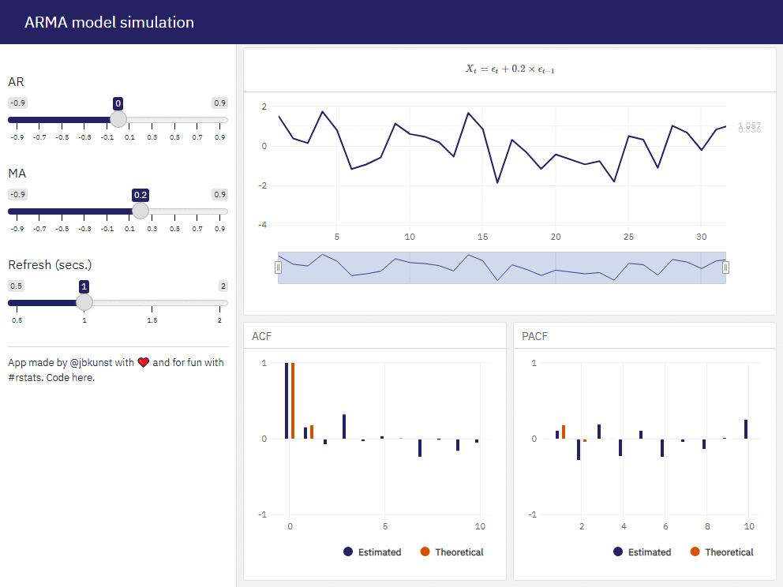
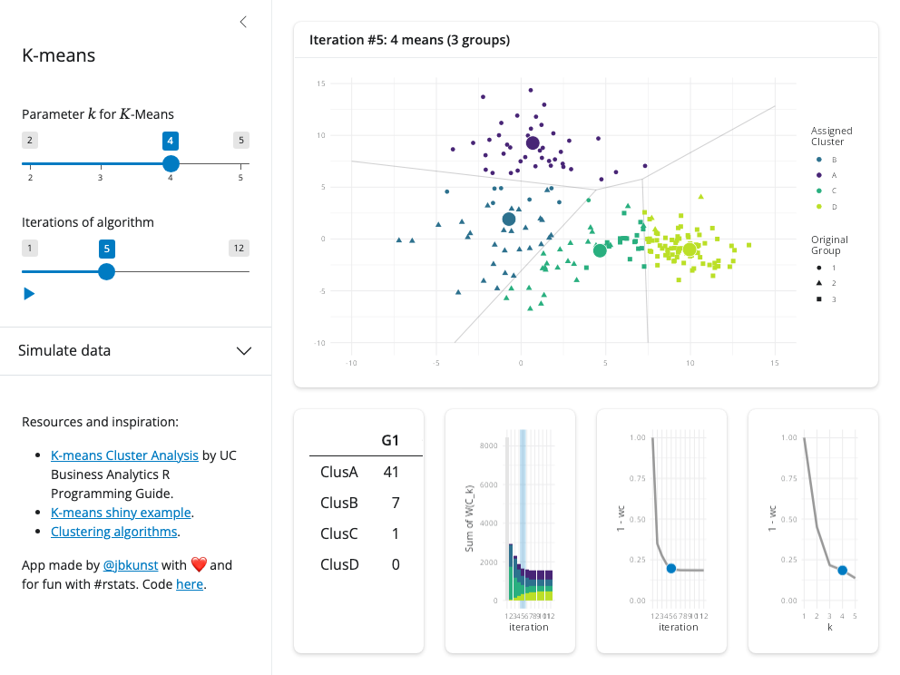

Shiny apps for educational purposes
================

- <a href="#foa--tell-me-y-" id="toc-foa--tell-me-y-">FOA: ♫ Tell me
  <em>Y</em> ♪</a>
- <a href="#using-apps-locally" id="toc-using-apps-locally">Using apps
  locally</a>
- <a href="#shiny-apps" id="toc-shiny-apps">Shiny apps</a>
  - <a href="#arma-process" id="toc-arma-process">ARMA Process</a>
  - <a href="#bias-variance" id="toc-bias-variance">Bias Variance</a>
  - <a href="#decision-tree" id="toc-decision-tree">Decision Tree</a>
  - <a href="#kmeans" id="toc-kmeans">Kmeans</a>
  - <a href="#kmeans-images" id="toc-kmeans-images">Kmeans Images</a>
  - <a href="#logistic-regression" id="toc-logistic-regression">Logistic
    Regression</a>
  - <a href="#matrix-decompositions" id="toc-matrix-decompositions">Matrix
    Decompositions</a>

## FOA: ♫ Tell me *Y* ♪

The ideas/purposes behind every shiny app in this repository are:

- Being a complement for a ML, Statistics, Probability, R class. The
  application mainly shows and exemplifies a *result* that needs to be
  explained. By themselves, the apps are just an app.
- Point out other resources and links that are more formal and/or
  useful.
- TBD.



## Using apps locally

There is a script `run_app.R` which contanins a helper function to
download the repo in a temporal folder and then you can run the apps

To load that function:

``` r
source("https://raw.githubusercontent.com/jbkunst/shiny-apps-edu/master/run_app.R")
```

Then you can use it giving the folder name, for example:

``` r
run_app("kmeans")
```

## Shiny apps

### ARMA Process

 Source code [here](/arma-process). See
the live version in
[shinyapps.io](https://jbkunst.shinyapps.io/arma-process). Go to
[index](#shiny-apps-for-educational-purposes).

### Bias Variance

 Source code [here](/bias-variance).
See the live version in
[shinyapps.io](https://jbkunst.shinyapps.io/bias-variance). Go to
[index](#shiny-apps-for-educational-purposes).

### Decision Tree

 Source code [here](/decision-tree).
See the live version in
[shinyapps.io](https://jbkunst.shinyapps.io/decision-tree). Go to
[index](#shiny-apps-for-educational-purposes).

### Kmeans

 Source code [here](/kmeans). See the live
version in [shinyapps.io](https://jbkunst.shinyapps.io/kmeans). Go to
[index](#shiny-apps-for-educational-purposes).

### Kmeans Images

 Source code [here](/kmeans-images).
See the live version in
[shinyapps.io](https://jbkunst.shinyapps.io/kmeans-images). Go to
[index](#shiny-apps-for-educational-purposes).

### Logistic Regression

 Source code
[here](/logistic-regression). See the live version in
[shinyapps.io](https://jbkunst.shinyapps.io/logistic-regression). Go to
[index](#shiny-apps-for-educational-purposes).

### Matrix Decompositions

 Source code
[here](/matrix-decompositions). See the live version in
[shinyapps.io](https://jbkunst.shinyapps.io/matrix-decompositions). Go
to [index](#shiny-apps-for-educational-purposes).
