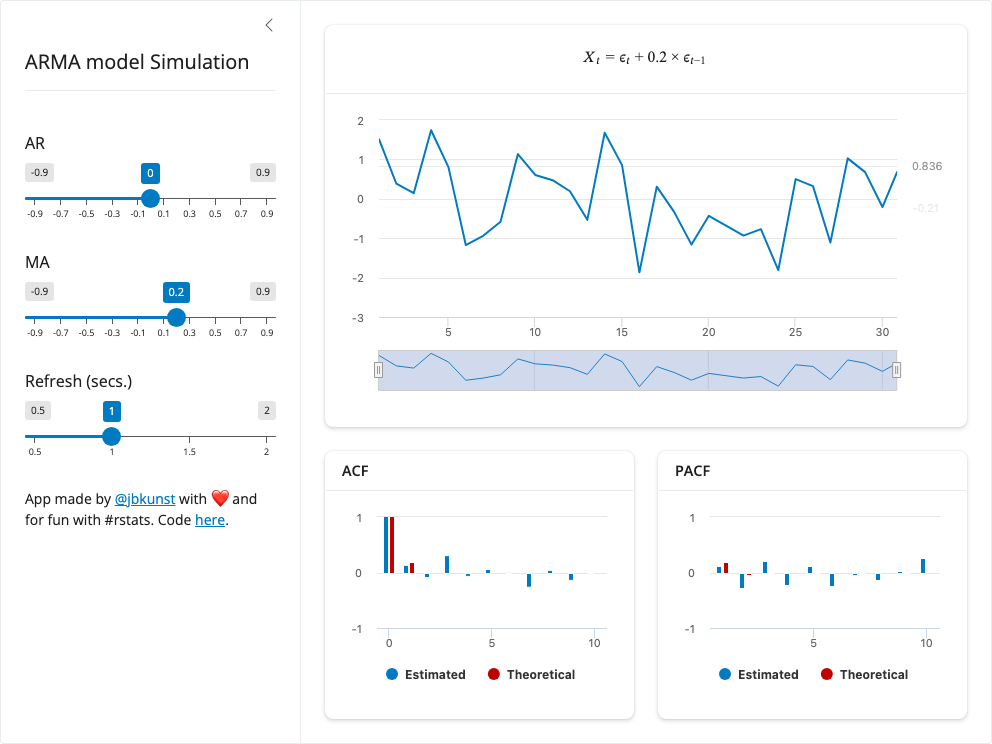
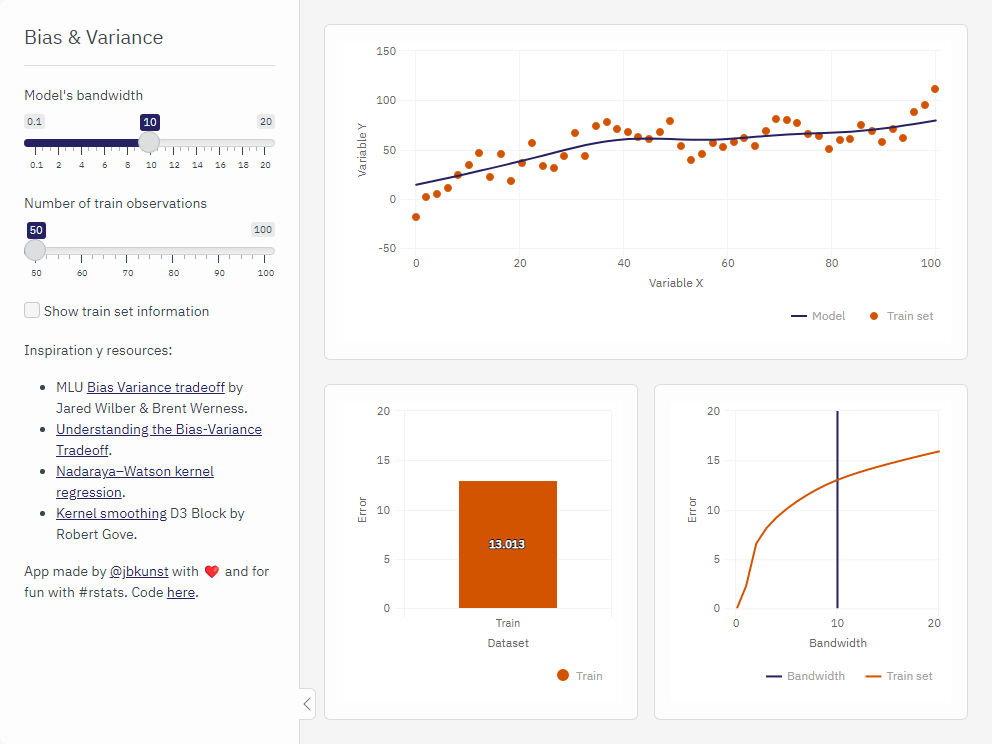
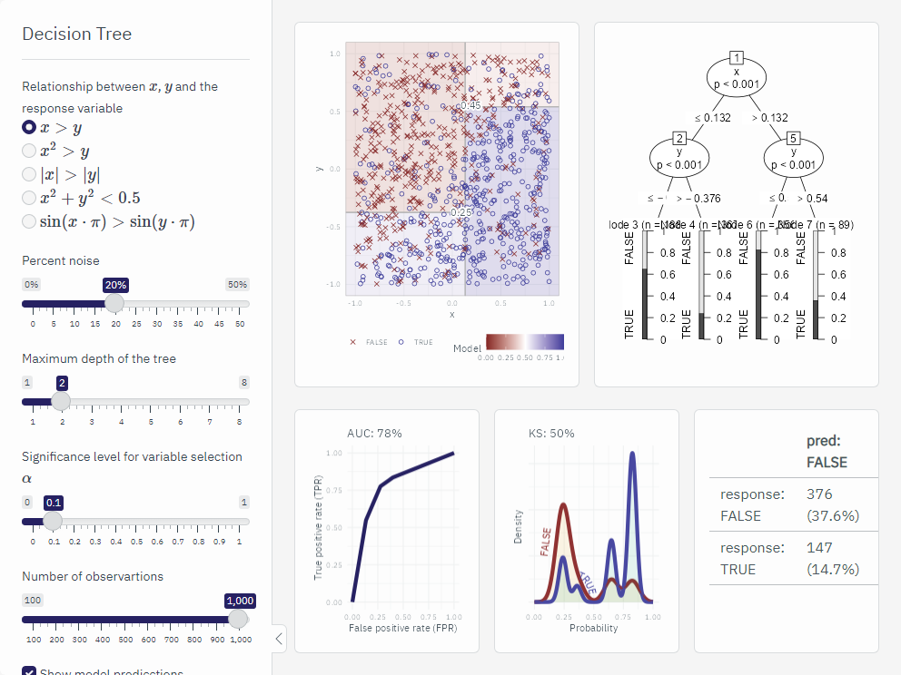
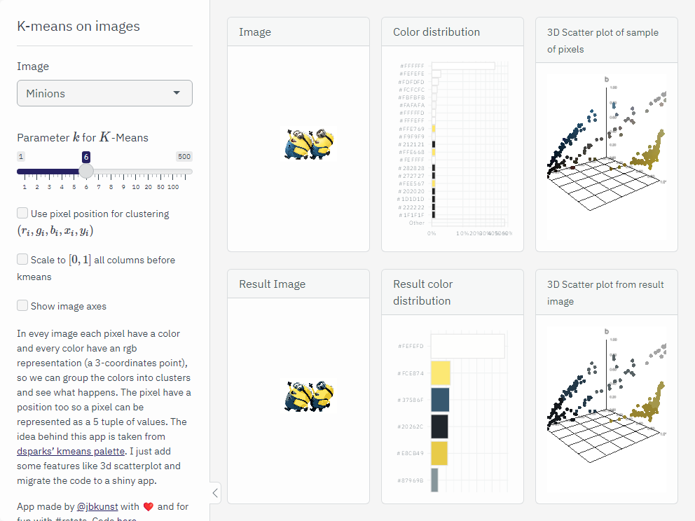
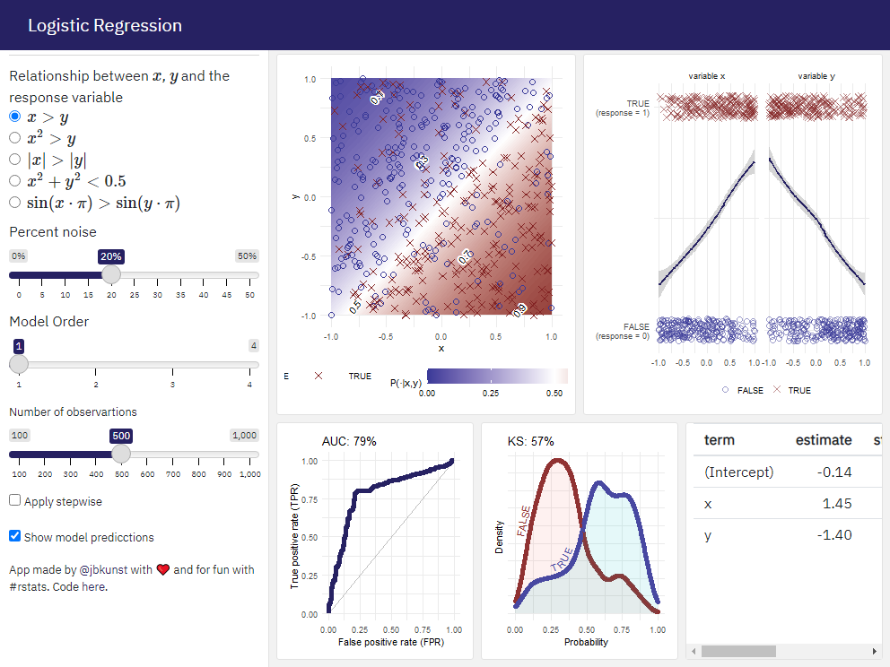
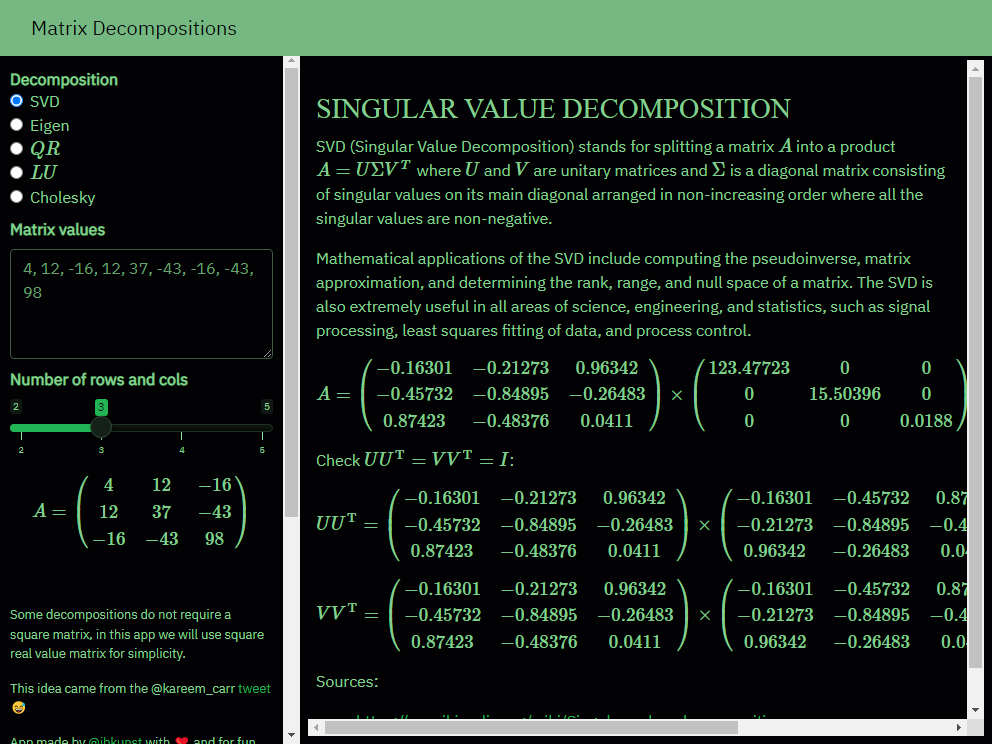

Shiny apps for educational purposes
================

-   [Using apps](#using-apps)
-   [Shiny apps](#shiny-apps)
    -   [ARMA Process](#arma-process)
    -   [Bias Variance](#bias-variance)
    -   [Decision Tree](#decision-tree)
    -   [Kmeans Images](#kmeans-images)
    -   [Logistic Regression](#logistic-regression)
    -   [Matrix Decompositions](#matrix-decompositions)

## Using apps

Use `subdir` argument to select the app to run, in this example the app
selected is `"matrix-decompositions"`.

## Shiny apps

### ARMA Process

 Source code
[here](tree/master/arma-process). Go to
[index](#shiny-apps-for-educational-purposes).

### Bias Variance

 Source code
[here](tree/master/bias-variance). Go to
[index](#shiny-apps-for-educational-purposes).

### Decision Tree

 Source code
[here](tree/master/decision-tree). Go to
[index](#shiny-apps-for-educational-purposes).

### Kmeans Images

 Source code
[here](tree/master/kmeans-images). Go to
[index](#shiny-apps-for-educational-purposes).

### Logistic Regression

 Source code
[here](tree/master/logistic-regression). Go to
[index](#shiny-apps-for-educational-purposes).

### Matrix Decompositions

 Source code
[here](tree/master/matrix-decompositions). Go to
[index](#shiny-apps-for-educational-purposes).
